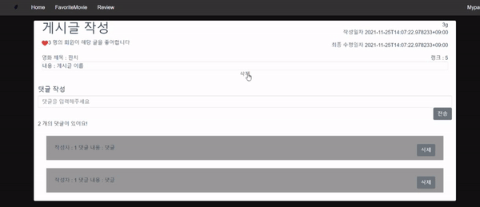

# Linked Movie

***

<소개>

영화 정보와 영화 추천 서비스를 제공하는 '링크드 무비'입니다.

'링크드 무비'는 좋아요를 표시한 영화 데이터를 바탕으로 추천 알고리즘을 제공하고, 비슷한 영화 취향을 가진 사용자를 연결해주는 서비스입니다.


## 1. 프로젝트 요구사항

***

### A.  관리자 뷰

i. 관리자 권한의 유저만 영화 등록/수정/삭제 권한을 가집니다. 

ii. 관리자 권한의 유저만 유저 관리 권한을 가집니다. 

iii. 장고에서 기본적으로 제공하는 admin 기능을 이용하여 구현합니다. 


### B. 영화 정보

i. 영화 정보는 Database Seeding을 활용하여 최소 50개 이상의 데이터가 존재하도록 구성해야 합니다. 

ii. 모든 로그인 된 유저는 영화에 대한 평점 등록/수정/삭제 등을 할 수 있어야 합니다.


### C. 추천 알고리즘

i. 평점을 등록한 유저는 해당 정보를 기반으로 영화를 추천 받을 수 있어야 합니다. 

ii. 추천 알고리즘의 지정된 형식은 없으나, 사용자는 반드시 최소 1개 이상의 방식으로 영화를 추천 받을 수 있어야 합니다. 

iii. 추천 방식은 각 팀별로 자유롭게 선택할  수 있으며 어떠한 방식으로 추천 시스템을 구성했는지 설명할 수 있어야 합니다.


### D. 커뮤니티

i. 영화 정보와 관련된 대화를 할 수 있는 커뮤니티 기능을 구현해야 합니다. 

ii. 로그인한 사용자만 글을 조회/생성할 수 있으며 작성자 본인만 글을 수정/삭제 할 수 있습니다. 

iii. 사용자는 작성된 게시 글에 댓글을 작성할 수 있어야 하며, 작성자 본인만 댓글을 삭제할 수 있습니다. 

iv. 각 게시글 및 댓글은 생성 및 수정 시각 정보가 포함되어야 합니다.


### E. 기타

i. 최소한 5개 이상의 URL 및 페이지를 구성해야 합니다. 

ii. HTTP Method와 상태 코드는 상황에 맞게 적절하게 반환되어야 하며, 필요에 따라 메시지 프레임워크 등을 사용하여 에러 페이지를 구성해야 합니다. 

iii. 필요한 경우 Ajax를 활용한 비동기 요청을 통해 사용자 경험을 향상 시켜야 합니다.


## 2. 담당업무

***

### 팀원 정보 및 업무 분담 내역

팀장 : 박수아 front-end 담당

- accounts app 구현(로그인/회원가입)
- community app 구현(게시판)
- movies app  구현(영화정보)
- 장르별 영화 추천 구현
- 디자인
- PPT 제작

팀원 : 조명근 back-end 담당

- 영화 API를 통해 DB에 영화 정보 호출
- accounts app 구현(로그인/회원가입)
- community app 구현(게시판)
- movies app  구현(영화정보)
- admin app 구현(관리자페이지)
- README작성


## 3. 개발환경

***

### A. 데이터베이스 모델링 (ERD)


### B. 개발환경 안내

- vue-router, vuex, bootstrap-vue, vue-axios

- requests, django-cors-headers, djangorestframework, djangorestframework-jwt

front, server 폴더 내의 package.json, requirements.txt에 필요한 모듈이 명시되어 있습니다.


### C. 시작하기

server 폴더

```
$ python -m venv venv
$ source venv/Scripts/activate

$ python manage.py migrate

json 데이터를 DB에 dump
$ python manage.py loaddata movies/fixtures/tmdb.json
$ python manage.py loaddata movies/fixtures/genre.json

$ python manage.py runserver
```


front 폴더

```
$ npm i
$ npm run serve
```


## 4. 프로젝트 소개

***

### 목표 서비스 구현 및 실제 구현  기능 설명

#### ⅰ. 영화 데이터 수집

**API**는 TMDB에서 데이터를 받아온 뒤 dump 하는 방식을 이용하였습니다.


#### ⅱ 모바일 대응을 위한 반응형 웹, REST API 서버

**RESTful API**는 vue와 django, 클라이언트와 서버가 정보를 주고받을 때 REST하도록 하였으며 주고받는 정보의 형태는 JSON을 이용했습니다.

**CORS (Cross Origin Resource Sharing)**는 Django와 Vue 사이의 교차 출처 리소스 공유를 위해 장고에서 처리해 주었습니다.


#### ⅲ. 영화 커뮤니티 필요 기능 구성



**JWT (Json Web Token)**를 통해 사용자 인증을 했습니다. 로그인 사용자만 글을 생성할 수 있으며, 작성자 본인만 글을 수정/삭제 할 수 있도록 구성했습니다.

사용자는 작성된 게시 글에 댓글을 작성할 수 있도록 했고, 작성자 본인만 댓글을 삭제할 수 있게 구성했습니다. 


로그인한 사용자만 글을 조회/생성할 수 있으며 작성자 본인만 글을 수정/삭제 할 수 있습니다. 


각 게시글 및 댓글은 생성 및 수정 시각 정보가 포함되었습니다.


#### ⅳ. 영화 추천 알고리즘


사용자에게 장르별 영화정보를 제공하여, 좋아하는 장르에서 영화를 추천받을 수 있도록 구성하였습니다.


#### ⅴ. 사이트 디자인

링크드 무비 서비스는 처음에 '중첩'이라는 키워드에서 아이디어를 얻었습니다. 영화를 탐색하면서 '취향의 중첩을 통한 영화 추천 서비스'를 바탕으로 디자인하였습니다.

디자인적 요소로는 div로 구성된 덩어리들이 색종이가 쌓이듯 표현하여 사이트의 정체성을 표현하였습니다.


메인 화면 상단에서는 최신 인기 영화 top3를 슬라이드 되는 화면으로 출력하였습니다.

하단에는 클릭시 lodash를 사용해 랜덤한 장르를 기준으로 한 영화 데이터와 인기 영화 top 50을 담았습니다

vuex를 이용하여 데이터를 store에 저장하고 사용하였습니다.


#### ⅵ. 추가기능


게시글에 좋아요 기능을 추가하였습니다.


## 5. 프로젝트를 통해 배운점

***

#### ⅰ. 영화 데이터 수집 구성시 어려운점과 해결방안

request를 이용하여 url을 통해 API요청 정보를 JSON으로 저장할 수 있었습니다. 하지만 DB에 저장하기 위해서 모델의 구조와 일치시켜야 저장이 가능했습니다. 그러기 위해서 모델 정의가 중요하였습니다.

#### ⅱ 모바일 대응을 위한 반응형 웹, REST API 서버 구성시 어려운점과 해결방안

JSON으로 불러오는 정보의 경우엔 Model을 어떤식으로 설정해야하는가

좋아요와 팔로우 직렬화시 urls에 담길 경로 네임을 담아서 view에 보내야 해결가능했었습니다.

#### ⅲ. 영화 커뮤니티 필요 기능 구성 구성시 어려운점과 해결방안

serializer를 활용하여 view에서 JSON정보를 다루는 것에서 어려웠습니다. 시행착오를 통해서 해결했지만, print 디버깅법과 serializer에 개념을 확실히 알아야 해결할 수 있었습니다.

#### ⅳ. 영화 추천 알고리즘 구성시 어려운점과 해결방안

view에서 python 라이브러리를 이용한 데이터를 JSON형식으로 보내는 것에서 어려움을 겪어 완성하지 못했습니다. 

#### ⅴ. 사이트 디자인 구성시 어려운점과 해결방안

